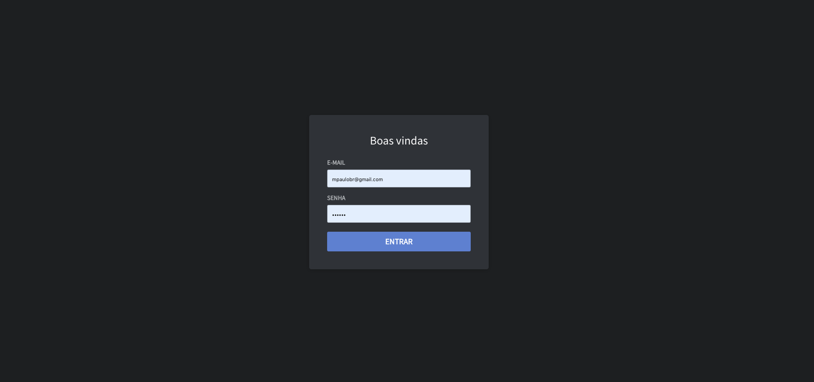
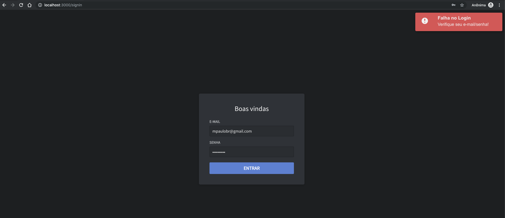

# OmniStack - Módulo Frontend - Aplicação em ReactJS

#Tela de Login


#Tela de Login - com erro de Autenticação


#Instalação recomenda para gerenciamento de pacotes: Yarn https://yarnpkg.com/pt-BR/docs/install#windows-stable

Instalar através do Chocolatey
O Chocolatey é um gerenciador de pacotes para Windows. Você pode instalar o Chocolatey seguindo este guia.

Assim que você tiver instalado o Chocolatey, você pode instalar o Yarn executando o seguinte código no console:

```sh
$ choco install yarn
```

#Instalando o Yarn no macOS

Homebrew
Você pode instalar Yarn através do gerenciador de pacotes Homebrew.

```sh
$ brew install yarn
```

Você pode usar soluções como nvm ou similares, você deve evitar installar o Node.js diretamente, para a versão do Node.js instalada pelo nvm ser usada.

```sh
$ brew install yarn --without-node
```

---

#Criando um projeto em ReactJS (através do CLI)

#Instalando o create-react-app

```sh
$ yarn global add create-react-app
```

#Criando o projeto com o create-react-app

```sh
$ create-react-app frontend
```

#iniciando a aplicação

```sh
$ yarn start
```

---

#Configurando o ESlint do Airbnb (no create-app 2, já vem com o ESLint)

```sh
$ yarn add eslint-config-airbnb eslint-plugin-import eslint-plugin-jsx-a11y eslint-plugin-react -D
```

## Em seguida, crie o arquivo .eslintrc

```js
{
  "parser": "babel-eslint",
  "extends": "airbnb",
  "env": {
    "browser": true,
    "jest": true
  },
  "plugins": ["react", "jsx-a11y", "import"],
  "rules": {
    "react/jsx-filename-extension": [
      "error",
      {
        "extensions": [".js", ".jsx"]
      }
    ],
    "import/prefer-default-export": "off"
  }
}

```

# Configurando o Babel-import para facilitar os imports da aplicação

```sh
$ yarn add react-app-rewired
```

```sh
$ yarn add babel-plugin-root-import -D
```

### Após isso, criar o arquivo de configuração config-overrides.js

```js
const { injectBabelPlugin } = require("react-app-rewired");

const rootImport = [
  "root-import",
  {
    rootPathPrefix: "~",
    rootPathSuffix: "src"
  }
];

module.exports = config => injectBabelPlugin(rootImport, config);
```

### No package.json, substituir a parte de scripts:

```json
    "start": "react-scripts start",
    "build": "react-scripts build",
    "test": "react-scripts test",
```

### Substitui por isso:

```json
    "start": "react-app-rewired start",
    "build": "react-app-rewired build",
    "test": "react-app-rewired test",
```

## Atualização do pacote react-app-rewire necessária:

```sh
$ yarn add customize-cra react-app-rewired --dev
```

### Observação: Ocorreu o seguinte problema com o xx, para isso, bastou atualizar a dependência:

```sh
Dont working for version > 2.0
The “injectBabelPlugin” helper has been deprecated as of v2.0. You can use customize-cra plugins in replacement — https://github.com/arackaf/customize-cra#available-plugins
```

## Para solucionar o problema do VSCode não encontrar o arquivo no import (~),

## basta instalar essa dependência

```sh
$ yarn add eslint-import-resolver-babel-plugin-root-import -D
```

## Outra configuração, quando clicar com o control+clique no import, para que ele abra o arquivo

###1 - criar o arquivo na raiz: jsconfig.json (Talvez, seja necessário reiniciar o VSCode)

```json
{
  "compilerOptions": {
    "baseUrl": ".",
    "paths": {
      "~/*": ["src/*"]
    }
  }
}
```

### Após as configurações, limpados os arquivos da aplicação, ficando somente o App.js e index.js.

---

## Instalando a dependências das Rotas

```sh
$ yarn add react-router-dom
```

---

## Configurando o Redux Saga

1. Crie uma pasta src/store/index.js
2. Crie uma pasta src/store/ducs/index.js
3. Crie uma pasta src/store/sagas/index.js

### Instale as dependências do Redux, saga e o axios

```sh
$ yarn add redux react-redux redux-saga axios
```

### Implementação - src/store/index.js

```js
import { createStore, applyMiddleware } from "redux";
import createSagaMiddleware from "redux-saga";

import rootReducer from "./ducks";
import rootSaga from "./sagas";

const sagaMiddleware = createSagaMiddleware();

const middlwares = [sagaMiddleware];

const store = createStore(rootReducer, applyMiddleware(...middlwares));

sagaMiddleware.run(rootSaga);

export default store;
```

---

### Implementação - src/store/sagas/index.js

```js
import { all } from "redux-saga/effects";

export default function* rootSaga() {
  return yield all([]);
}
```

---

### Implementação - src/store/ducks/index.js

```js
import { combineReducers } from "redux";

export default combineReducers({
  test: () => []
});
```

---

### Após a configuração inicial, é necessário passar para o restante da aplicação:

#### Onde: App.js

```js
import React from "react";
import { Provider } from "react-redux";

import store from "./store";
import Routes from "./routes";

const App = () => (
  <Provider store={store}>
    <Routes />
  </Provider>
);

export default App;
```

### Fim da configuração do Redux/Sagas

---

### Instalando a dependência para estilização (StyledComponents)

```sh
$ yarn add styled-components
```

### Passo seguinte, crie uma pasta src/styles

---

### Instalação da dependência ReduxSauce e Seamless-immutable (manter a imutabilidade dentro do duck)

```sh
$ yarn add reduxsauce seamless-immutable
```

\*\*\* Lembrete: Snippet da RocketSeat -

#### Para criar um duck, basta digitar no arquivo js a palavra: rsduck

Criação do Duck de autenticação:

```js
import { createReducer, createActions } from "reduxsauce";
import Immutable from "seamless-immutable";

/* Types & Action Creators */

const { Types, Creators } = createActions({
  signInRequest: ["email", "password"],
  signInSuccess: ["token"]
});

export const AuthTypes = Types;
export default Creators;

/* Initial State */

export const INITIAL_STATE = Immutable({
  signedIn: false,
  token: null
});

/* Reducers */

export const success = (state, { token }) => state.merge({ signedIn: true, token });

/* Reducers to types */

export const reducer = createReducer(INITIAL_STATE, {
  [Types.SIGN_IN_SUCCESS]: success
});
```

### Instalando os Proptypes

```sh
$ yarn add prop-types
```

---

### Componente para mensagem React-Redux-Toastr

```sh
$ yarn add react-redux-toastr
```

---

### Componente para trabalhar com rotamento com o Saga

Conectar o React-Router-dom com o redux

```sh
$ yarn add connected-react-router history
```
